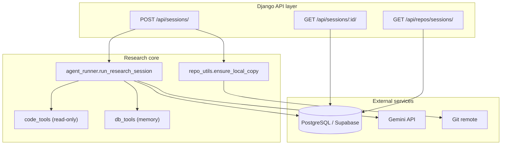
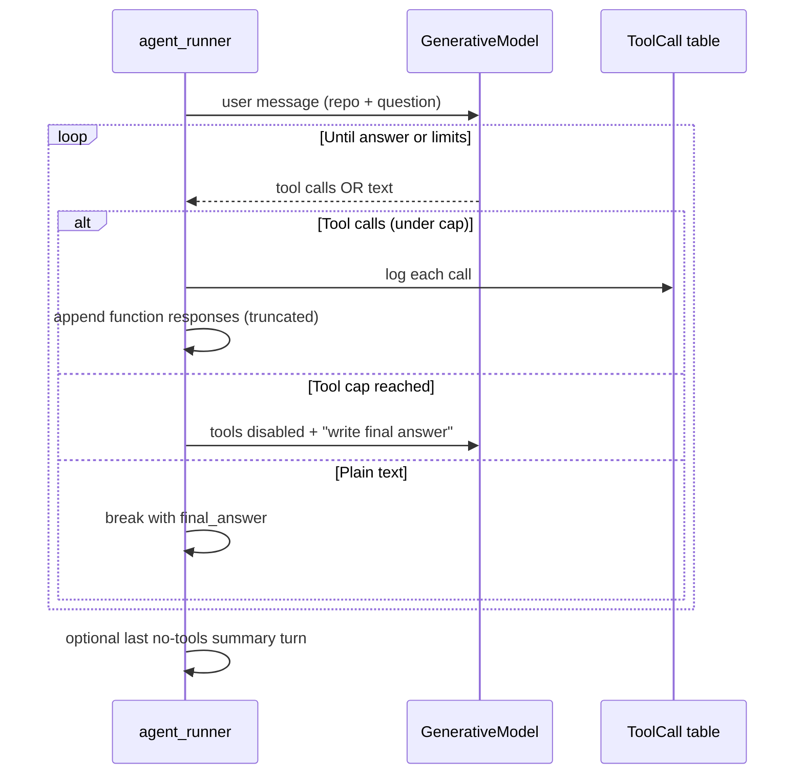
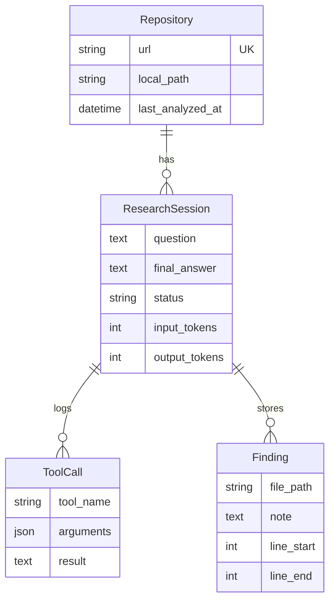

# Architecture & Design Decisions

This document explains **why** the Codebase Research Agent is shaped the way it is: the agent loop, persistence model, Gemini integration, and deliberate limits on cost and context.

---

## System architecture

The API is intentionally **thin**: views clone the repo, invoke one synchronous agent run, and serialize ORM state. There is no separate worker queue—simplicity for demos and assignment scope, at the cost of long HTTP request times.

---

## Agent loop

**Why explicit tool dispatch (not SDK auto-function-calling)?** Full control over logging, truncation, caps, and retries. Every invocation becomes a `ToolCall` row for debugging and demos.

---

## Database schema

**Rationale:** `Repository` is keyed by URL so clones and session history are shared. `ResearchSession` is the audit unit (question, answer, token usage, status). `ToolCall` is append-only observability; `Finding` is the agent’s curated memory, smaller than raw tool payloads.

**Trade-offs:** Normalized and query-friendly, but `ToolCall.result` can grow large—we truncate before sending to Gemini, not necessarily in the DB. No vector store: retrieval is grep + model reasoning, which is cheaper and easier to explain in a demo.

---

## Why Gemini?

Gemini was chosen for **native function calling**, competitive **context windows**, and a straightforward **Google AI Studio** key for prototypes. The `google-generativeai` SDK maps cleanly to “messages + tools + function responses,” matching our manual loop. Alternatives (OpenAI, Claude) would work with the same architecture; the coupling is isolated to `agent_runner.py`.

Default model **`gemini-2.5-flash-lite`** balances free-tier quotas, latency, and quality. **`GEMINI_DEMO_MODE`** provides a quota-free path: local `search_code` only, for reliable presentations.

---

## Context window management

| Technique | Purpose |
|-----------|---------|
| Cap `read_file` lines, list entries, search hits | Limit per-tool payload |
| Skip `docs/` in search | Avoid i18n doc floods |
| `GEMINI_MAX_TOOL_RESULT_CHARS` | Bound JSON replayed into the chat |
| Short system prompt + concise user prefix | Fewer fixed tokens per turn |
| `GEMINI_MAX_OUTPUT_TOKENS` | Prevent huge completions |
| Max **10 tool calls**, then disable tools | Reserve iterations for the final answer |
| **20** max iterations + final no-tools turn | Recover when the model stalls |

Stopping conditions: **(1)** model returns plain text without tools, **(2)** tool cap forces answer mode, **(3)** iteration limit with a last-chance summary call, **(4)** demo mode short-circuit, **(5)** hard failures (blocked prompt, missing repo, API error after retries).

---

## With more time

- **Async jobs** (Celery/RQ) + `POST` returning `202` and session polling.
- **Streaming** partial answers and tool events over SSE/WebSockets.
- **Smarter retrieval** (ripgrep, AST chunking, embeddings) instead of raw substring search.
- **Rate limiting** and API authentication per tenant.
- **Stronger tests**: mocked Gemini, full HTTP integration tests.

---

## AI-assisted development

This project was built with **AI coding assistants** (e.g. Cursor) for scaffolding Django models/views, iterating on Gemini error handling (404 model ids, 429 quotas), and tightening the agent prompt after observing real runs—e.g. sessions that burned ~65k input tokens on translated docs. Human review focused on security (`path` traversal), synchronous API semantics, and operability (env knobs, demo mode).

---

## Known limitations

- **Synchronous POST** can time out on slow networks or large repos.
- **No auth** on API endpoints in default settings (`DEBUG` + CORS permissive).
- **Free-tier Gemini** quotas can block live demos; demo mode is not a substitute for real reasoning.
- **Search** is literal/glob, not semantic; monorepos and generated code can confuse the agent.
- **Single-threaded** agent per request—no parallel tool execution.
- Cloned repos live on disk under `repos/`; disk usage and Git failures are operational concerns.

---

*For setup and API examples, see [README.md](./README.md).*
